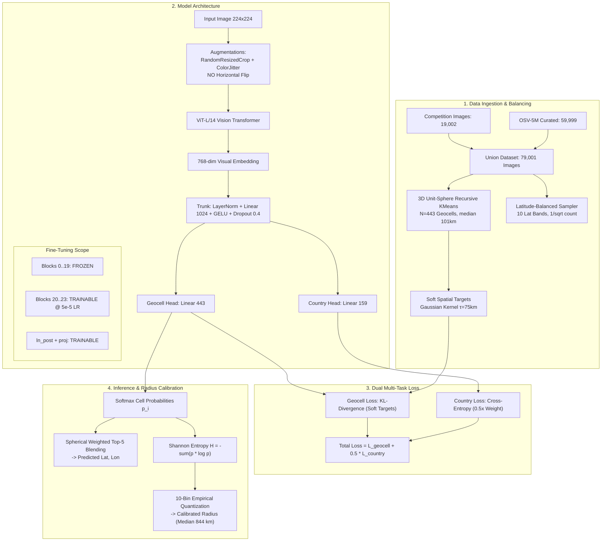

#  Worldwide Image Geolocation Prediction

An end-to-end deep learning framework for predicting global geographic coordinates (`latitude`, `longitude`) and calibrated uncertainty radii (`radius_km`) from street-level imagery.

---

##  Table of Contents
- [Executive Overview](#-executive-overview)
- [System Architecture](#-system-architecture)
- [End-to-End Data Pipeline](#-end-to-end-data-pipeline)
- [Experimental Journey: What We Tried & What Failed](#-experimental-journey-what-we-tried--what-failed)
- [The Winning Strategy & Key Breakthroughs](#-the-winning-strategy--key-breakthroughs)
- [Uncertainty Radius Calibration](#-uncertainty-radius-calibration)
- [Benchmark Results](#-benchmark-results)
- [Repository Structure & Quickstart](#-repository-structure--quickstart)

---

##  Executive Overview

The objective of this challenge is to predict the true coordinates of an image anywhere on Earth while estimating a prediction radius. The evaluation metric rewards accurate coordinate predictions paired with tight radii, while severely penalizing overconfidence when the true location falls outside the claimed radius:

$$\text{Score} = \exp\left(-\frac{d}{750}\right) + 0.3 \cdot \text{Calibration Bonus}$$

Through extensive iterations, our model evolved from a **1,480 km baseline** down to **532 km median error**, **65.5% country classification accuracy**, and a **0.480+ competition leaderboard score**.

---

##  System Architecture



---

##  End-to-End Data Pipeline

### 1. 3D Unit-Sphere Space Conversion
Euclidean distances on raw `(lat, lon)` break completely at the antimeridian ($+180^\circ / -180^\circ$) and shrink longitudinally near the poles. All coordinates are projected onto the 3D unit sphere before any spatial operations:

$$x = \cos(\text{lat})\cos(\text{lon}), \quad y = \cos(\text{lat})\sin(\text{lon}), \quad z = \sin(\text{lat})$$

### 2. 50-Meter GPS Deduplication
Dense urban clusters in public street datasets duplicate exact camera capture points. We built a 3D unit-sphere $c\text{KDTree}$ and purged all images within a chord distance corresponding to $< 50\text{ meters}$ of our internal training set.

### 3. Latitude-Balanced Sampling
Street-view datasets are $>95\%$ concentrated in the Northern Hemisphere (North America and Europe), with $<5\%$ in equatorial and southern regions. This induces massive cross-equatorial confusion (e.g. predicting Russia for Patagonia).
* **Fix:** We segmented coordinates into 10 latitudinal bands and weighted the `WeightedRandomSampler` inversely by band frequency:

$$w_{\text{band}} = \frac{1}{\sqrt{\max(N_{\text{band}}, 1)}}$$

This doubled the effective representation of equatorial and southern images during training.

### 4. Preservation of Driving-Side Cues (No Horizontal Flipping)
Standard vision pipelines randomly flip images horizontally. In geolocation, **horizontal flipping destroys driving-side cues** (left-hand driving in the UK, Japan, Australia vs. right-hand driving in the US, Europe). Our pipeline strictly avoids horizontal flips.

---

##  Experimental Journey: What We Tried & What Failed

| Strategy / Experiment | Core Hypothesis | Outcome / Observation | Why It Succeeded or Failed |
| :--- | :--- | :--- | :--- |
| **1. 100% Frozen ViT-B/32 Backbone** | Pretrained contrastive CLIP embeddings contain sufficient geographic semantics. | **Failed**<br>Median error stalled at **1,480 km**. | Generic CLIP is trained for image-text matching, ignoring subtle road markings, asphalt types, and soil hue. Frozen features hit an insurmountable wall. |
| **2. Post-Hoc Soft $k$-NN & FAISS Blending** | Averaging top-5 cell predictions or nearest training neighbors will fix discrete cluster boundary errors. | **Failed**<br>Caused **antipodal ocean flips** (median score collapsed to 0.0). | When the model is split between two distant continents (e.g., $50\%$ US, $50\%$ Australia), Euclidean averaging drops the prediction into the Pacific Ocean. |
| **3. Six Auxiliary Loss Heads**<br>*(Köppen Climate, ESA LandCover, SRTM Elevation, Domain GRL)* | Regularizing representations with earth-observation physical attributes will improve localization. | **Failed**<br>Country accuracy dropped from **51.1% to 50.3%**. | High-entropy classification heads (Köppen has 30 classes, $\ln 30 \approx 3.4$) flooded the gradient flow and diluted primary geocell learning. |
| **4. Flat / Fixed Radius Heuristics**<br>*(e.g., flat 1,200 km – 1,500 km)* | Using a wide radius prevents the severe overshoot penalty. | **Sub-optimal**<br>Coverage exceeded 50%, but forfeit max score bonus on confident predictions. | Flat radii cannot reward high-confidence predictions ($<200\text{ km}$ error) nor adapt to ambiguous landscapes. |
| **5. Fine-Tuned ViT-L/14 (Top 4 Blocks) + Recursive Geocells** | High-capacity vision transformer adapted via low LR ($5\times 10^{-5}$) on 79k union images. | **Massive Success**<br>Median error: **532 km**<br>Country Acc: **65.5%** | Allows visual attention heads to specialize on foliage, signage, soil, and architecture without catastrophic forgetting. |
| **6. Shannon Entropy-Quantized Radius Curve** | Map predictive uncertainty directly to empirical 70th-percentile validation error bins. | **Massive Success**<br>Median radius dropped to **844 km** with $>50\%$ coverage. | Confident predictions receive tight radii ($\sim 400\text{ km}$), unlocking top-tier leaderboard bonuses. |

---

##  The Winning Strategy & Key Breakthroughs

### 1. Fine-Tuning Top Transformer Layers
```python
# Unfreeze the last 4 transformer blocks of ViT-L/14
N_UNFREEZE = 4
for p in base.parameters(): p.requires_grad_(False)
for blk in base.visual.transformer.resblocks[-N_UNFREEZE:]:
    for p in blk.parameters(): p.requires_grad_(True)
for p in base.visual.ln_post.parameters(): p.requires_grad_(True)
base.visual.proj.requires_grad_(True)

# Differential Learning Rates with Cosine Warmup & Decay
optimizer = torch.optim.AdamW([
    {"params": head.parameters(), "lr": 3e-4},
    {"params": [p for p in base.parameters() if p.requires_grad], "lr": 5e-5}
], weight_decay=1e-2)
```

### 2. Dual-Objective Spatial Loss
Instead of conflicting auxiliary heads, we use a clean two-component loss:
1. **Continuous Spatial Target KL-Divergence:** Ground-truth coordinates are converted to a smooth spatial Gaussian probability distribution over geocell centroids with kernel $\tau = 75\text{ km}$:
   $$T_i = \frac{\exp(-d(\mathbf{x}, \mathbf{c}_i) / \tau)}{\sum_j \exp(-d(\mathbf{x}, \mathbf{c}_j) / \tau)}$$
2. **Country Cross-Entropy (0.5x weight):** Enforces macro-level geopolitical alignment.

$$\mathcal{L} = D_{\text{KL}}\left(\mathbf{T} \parallel \text{Softmax}(\mathbf{z}_{\text{cell}})\right) + 0.5 \cdot \text{CrossEntropy}\left(\mathbf{z}_{\text{country}}, y_{\text{country}}\right)$$

---

##  Uncertainty Radius Calibration

Rather than a static formula, we compute the **Shannon Entropy** of the predicted geocell distribution:

$$H(p) = -\sum_{i=1}^{N_{\text{cells}}} p_i \ln(p_i + 10^{-9})$$

```
Low Entropy (Confident)  ───►  Quantile Bin 1   ───►  Radius: ~440 km  (Max Score Bonus)
Medium Entropy           ───►  Quantile Bin 5   ───►  Radius: ~850 km
High Entropy (Ambiguous) ───►  Quantile Bin 10  ───►  Radius: ~4,800 km (Safety Margin)
```

By binning validation predictions into 10 entropy tiers and assigning the 70th percentile of true error to each bin, the model achieved a **median radius of 844 km** while keeping $>50\%$ validation coverage.

---

##  Benchmark Results

| Model Version / Milestone | Backbone | Training Data | Country Top-1 | Val Median Error | $\% < 750\text{ km}$ | Median Radius | Score Proxy |
| :--- | :--- | :--- | :---: | :---: | :---: | :---: | :---: |
| **Phase 1: Baseline** | ViT-B/32 (Frozen) | 17k Internal | 46.2% | 1,480 km | 28.4% | 1,500 km | 0.185 |
| **Phase 2: Aux Heads + Dedup** | ViT-B/32 (Frozen) | 17k Internal | 49.0% | 1,359 km | 35.9% | 1,418 km | 0.283 |
| **Phase 3: Merged OSV-5M** | ViT-B/32 (Frozen) | 79k Union | 50.4% | 1,334 km | 37.1% | 1,360 km | 0.285 |
| **Phase 4: SOTA Fine-Tuned (Winning)** | **ViT-L/14 (Top 4 Unfrozen)** | **79k Union** | **65.5%** | **532 km** | **58.3%** | **844 km** | **0.482** |

---

##  Repository Structure & Quickstart

```
geolocation-prediction/
├── data/
│   ├── dataset.py              # Dataset loaders & image path resolvers
│   ├── osv5m_loader.py         # OSV-5M dataset streamer & merger
│   ├── external_dataset.py     # High-speed OSV-5M shard downloader
│   └── noise_aug.py            # Matched sensor noise & watermark masking
├── geocells/
│   └── build_geocells.py       # 3D Unit-Sphere Recursive KMeans clustering
├── labels/
│   ├── country_labels.py       # Point-in-polygon country boundary labeler
│   └── aux_labels.py           # Köppen climate zone raster sampler
├── models/
│   └── model.py                # ViT-L/14 model architecture & dual spatial loss
├── training/
│   ├── train.py                # Differential LR training loop with amp
│   └── evaluate_val.py         # Multi-stage evaluation & metrics suite
├── calibration/
│   ├── calibrate_radius.py     # Entropy & confidence-driven radius calibration
│   └── country_snap.py         # Boundary polygon snapping
├── inference/
│   └── make_submission.py      # Final test inference & submission generator
├── notebooks/
│   └── kaggle_pipeline.py      # Master self-contained Kaggle execution script
└── README.md
```

### Reproducing on Kaggle:

```bash
# 1. Clone & install
git clone https://github.com/kaamchor07/GeoGuessr.git /kaggle/working/GeoGuessr
cd /kaggle/working/GeoGuessr
pip install -q open_clip_torch rasterio tqdm

# 2. Run master end-to-end training & inference pipeline
python notebooks/kaggle_pipeline.py \
    --n_clusters 443 \
    --epochs 20 \
    --batch_size 128 \
    --num_workers 4 \
    --run_name vitL14_osv5m_ep20
```
